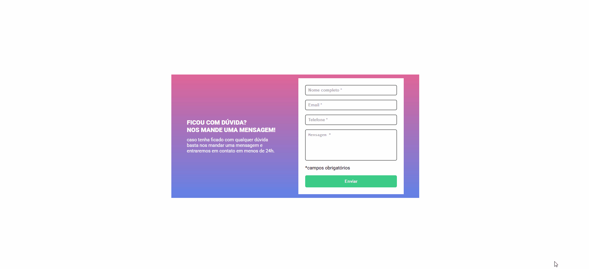

# 📩 Contact Form with Validation

## 📚 Table of Contents
- [📌 Overview](#-overview)
- [🎯 The Challenge](#-the-challenge)
- [🖼️ Preview](#preview)
- [🔗 Links](#-links)
- [🛠️ Built With](#️-built-with)
- [⚙️ Features](#️-features)
- [🧠 What I Learned](#-what-i-learned)
- [🚀 Continued Development](#-continued-development)
- [👨‍💻 Author](#-author)
- [🤖 AI Collaboration](#-ai-collaboration)

---

## 📌 Overview

This project is a contact form with validation for required fields using vanilla JavaScript.

The goal was to practice:
- DOM manipulation
- Form events
- Field validation
- Writing clean and scalable code

---

## 🎯 The Challenge

Build a contact form where:

- All fields are required
- The form is blocked from submitting if there are empty fields
- Invalid fields display an error message
- Errors are removed dynamically as the user types

---

## 🖼️ Preview

### 🖥️ Desktop

---

## 🔗 Links

- 🟢 Live Site: [ADD YOUR LINK HERE]

---

## 🛠️ Built With

- HTML5
- CSS3
- JavaScript (DOM)

---

## ⚙️ Features

✔ Required field validation  
✔ Prevent form submission on error  
✔ Visual feedback with red borders  
✔ Dynamic error messages  
✔ Real-time error removal while typing  

---

## 🧠 What I Learned

During this project, I learned important concepts such as:

- The difference between `querySelector` and `querySelectorAll`
- How to loop through elements using `forEach`
- How to properly use `addEventListener`
- Why using the `submit` event is better than `click`
- How to avoid adding duplicate event listeners
- Structuring code by separating logic and events
- Using BEM modifiers for state management

---

## 🚀 Continued Development

- [ ] Add email format validation
- [ ] Add specific error messages
- [ ] Add error animations
- [ ] Improve responsiveness

---

## 🤖 AI Collaboration

This project used AI support for:
- Code review
- Best practices guidance
- JavaScript logic improvements

All development and understanding were actively carried out to ensure real learning of the concepts.

---

## 👨‍💻 Author
- GitHub - [@israel-monteiro](https://github.com/israel-monteiro)

